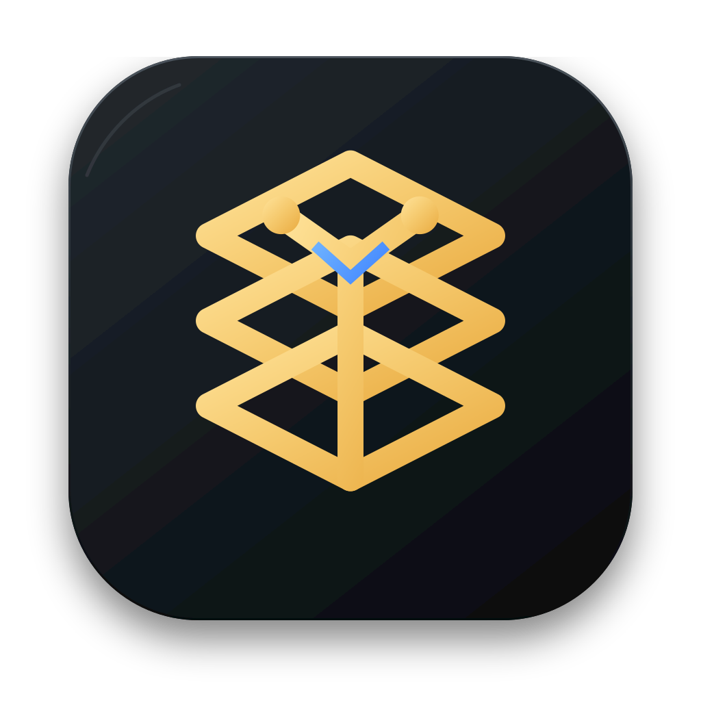
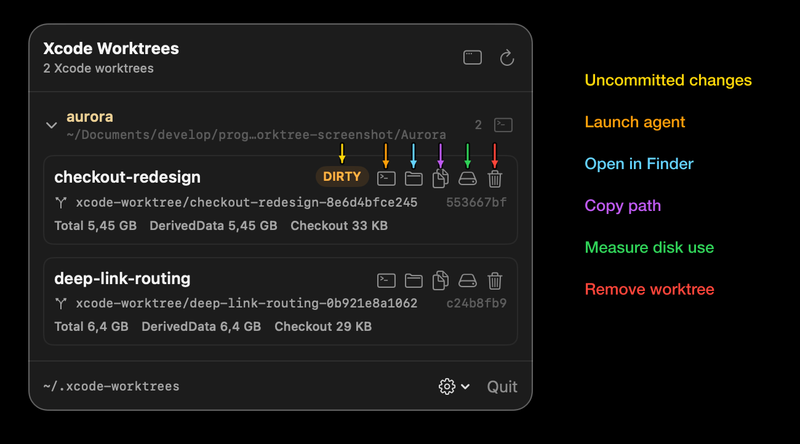

<p align="center">
  
</p>

<h1 align="center">Xcode Worktree</h1>

<p align="center">
  <strong>Durable worktrees and local DerivedData for parallel Xcode agents.</strong>
</p>

<p align="center">
  <a href="https://github.com/mariorossano/xcode-worktree/actions/workflows/ci.yml"></a>
  
  
  
  <a href="LICENSE">
    
  </a>
</p>

Coding agents were already avoiding Xcode cache conflicts by assigning a
different DerivedData path to each parallel task. The problem was placement:
different tools and sessions scattered worktrees and build output around the
filesystem, consuming disk space and leaving external caches outside the view
of Git clients. In the worst case, active work placed under `/tmp` disappeared
after a reboot.

Xcode Worktree fixes this:

- **Isolate** parallel tasks with one branch, checkout, and build directory each.
- **See** every managed worktree, dirty state, commit, and disk footprint in a
  small menu-bar app.
- **Clean up** the checkout and its local DerivedData together, while preserving
  the branch.

Pair it with [SimLease](https://github.com/alexissan/simlease) to give parallel
agents separate iOS simulators too. I use both so several Xcode tasks can build
and run at once without manually tracking checkouts, caches, or simulator
ownership.

## Install

### Automatic installation

Clone this repository into a durable location, then install:

```bash
git clone https://github.com/mariorossano/xcode-worktree.git
cd xcode-worktree
make install
```

`make install` builds and signs the app, copies it to
`~/Applications/Xcode Worktree.app`, and installs the Xcode Worktree skills for
Codex and the default Claude profile, when that profile exists.

<details>
<summary>Automatic installation details</summary>

The installer links the repository rather than creating an independent skill
copy, so `SKILL.md` and `agents/openai.yaml` remain the sources of truth. It
refuses to replace an unrelated existing skill or an application with a
different bundle identifier.

For an additional Claude profile, pass its exact directory. Spaces and other
ordinary path characters are preserved:

```bash
make install AGENT_PROFILE_DIRS="/path/to/claude-profile"
```

Run the command once for each additional profile. The installer reports other
`.claude*` directories it recognizes but does not modify them automatically.

The app uses an ad-hoc signature and requires no Apple developer account. A
stable Developer ID signature belongs to a future release workflow.

</details>

<details>
<summary><strong>Manual installation</strong></summary>

Build the app without installing anything:

```bash
make app
```

Then:

1. Copy `dist/Xcode Worktree.app` to the Applications folder or other durable
   location you prefer.
2. Copy the skill files into every agent or profile that should use the
   workflow:
   - For Codex, copy `SKILL.md` and `agents/openai.yaml`. The YAML file provides
     Codex's UI metadata.
   - For Claude, copy `SKILL.md`.

Common user-level destinations are:

| Agent | Source | Destination |
| --- | --- | --- |
| Codex | `SKILL.md` | `~/.agents/skills/xcode-worktree/SKILL.md` |
| Codex | `agents/openai.yaml` | `~/.agents/skills/xcode-worktree/agents/openai.yaml` |
| Claude | `SKILL.md` | `~/.claude/skills/xcode-worktree/SKILL.md` |
| Claude with `CLAUDE_CONFIG_DIR` | `SKILL.md` | `<CLAUDE_CONFIG_DIR>/skills/xcode-worktree/SKILL.md` |

Both agents also support repository-scoped skills. Use the equivalent
`.agents/skills` or `.claude/skills` directory inside a repository when the
workflow should not be global. For Codex, install the metadata at
`<repository>/.agents/skills/xcode-worktree/agents/openai.yaml`. Restart the
agent if a newly created top-level skills directory is not detected.

</details>

## 60-second quick start

1. Launch `Xcode Worktree.app` first and leave it running in the menu bar. An
   empty list is expected before the first task.
2. From a repository's main checkout, start Claude or Codex and ask:

   > Create an isolated Xcode worktree for this task.

3. The skill creates the checkout, keeps Xcode DerivedData inside it, and runs
   the task there. The worktree appears automatically in the menu-bar app.
4. When the task is finished, release it in one of two ways:

   - **From the same Terminal session:** ask the agent to
     `Release this worktree and the resources used by this task`. Use this route
     when the task also acquired a simulator or another external resource.
   - **From the app:** choose `Remove` for a clean checkout, or
     `Commit & Remove` to preserve current changes before removal. The app
     manages the checkout and its local Xcode build output only.

## The menu-bar board

<p>
  
</p>

The app groups managed worktrees by repository and reads their state live from
Git and the filesystem. Each row can show:

- task name, managed branch, short `HEAD`, and dirty state;
- recent commits and expandable commit messages;
- total, DerivedData, and checkout disk use, measured only on request;
- attention states for managed folders Git can no longer validate.

From a worktree row you can launch an agent in Terminal, open the checkout in
Finder, copy its path, measure disk use, inspect commits, or release it. The
same board can open in a regular window that remains visible when the menu-bar
panel loses focus.

<details>
<summary>Launching agents from the app</summary>

Agent commands are entered by the user rather than hardcoded. Commands such as
`codex`, `claude-company`, or `claude-me` are kept in a small local history and
run through the user's interactive shell, so functions and aliases work too.
The exact command is stored locally; do not put credentials or other secrets in
command-line arguments.

Launching an agent does not make one checkout safe for multiple writers. Give
each parallel agent its own worktree. An agent launched from the board starts
with the selected worktree as its current directory.

</details>

## How isolation works

The skill creates worktrees with this layout:

```text
~/.xcode-worktrees/<repository>/<task>-<id>
```

Each worktree gets its own `xcode-worktree/<task>-<id>` branch. Git and the
filesystem remain the source of truth; the app has no worktree registry,
daemon, lease protocol, or activity tracking.

Before any Xcode project action—including discovery, dependency resolution,
build, test, or run—the skill verifies that both the selected project or
workspace and DerivedData are inside the worktree. It applies those paths using
temporary interface settings and restores any changed state before release.
For XcodeBuildMCP it reads the live session defaults, sets the worktree project
or workspace and `derivedDataPath` with `persist: false`, then verifies the
result. If a build integration cannot configure and verify both its input and
output paths, the agent stops instead of claiming isolation.

The Git lifecycle also works for non-Xcode repositories. Automatic build-cache
isolation and cleanup cover only Xcode DerivedData; other build systems remain
responsible for their own output paths.

<details>
<summary><code>git-crypt</code> repositories</summary>

Repositories using the default `git-crypt` key are prepared during worktree
creation. The skill checks out encrypted blobs first, installs the already
unlocked common key into the linked worktree's private Git metadata, and then
checks out the files through the real filters. It never copies decrypted files
from the main checkout or disables encryption for ordinary Git operations.

Creation stops with an explicit diagnostic when the common key is unavailable
or a named `git-crypt` key is in use. Repositories without an applied
`git-crypt` attribute follow the ordinary worktree path.

</details>

## Behavior and limits

- The app refreshes when it becomes visible, once per minute while a menu or
  regular window remains open, and on manual refresh. It does not scan while
  the interface is closed.
- The skill creates `~/.xcode-worktrees` on the first explicit worktree request;
  installing the app alone does not create it.
- The app cannot infer reliable last-used time, agent identity, session
  identity, or agent activity because Git does not store those values.
- Login-item registration is available from the settings menu. If macOS needs
  approval, the app opens the relevant System Settings pane.
- The app scans only the fixed two-level layout below `~/.xcode-worktrees` and
  never follows symlinks while discovering candidates.

<details>
<summary>macOS permissions</summary>

macOS can ask for access when a repository's Git metadata is in Documents or
Desktop. The dialog may appear behind the menu-bar panel; close the panel,
grant access only to repositories you want inspected, then refresh.

The first agent launch can also trigger an Automation prompt because the app
asks Terminal to open a new window and run the command entered by the user.
Scanning and the rest of the app continue to work without that permission.

</details>

## License

MIT — see [LICENSE](LICENSE).
